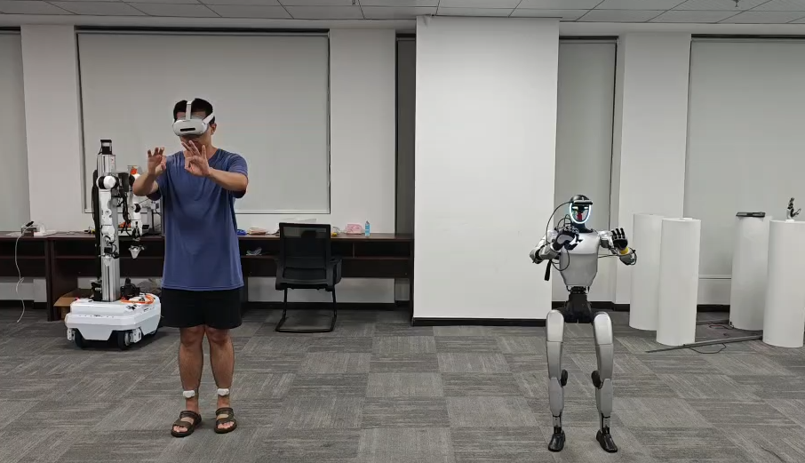

<p align="center">
  
</p>

<h1 align="center">Teleopit</h1>

<p align="center">
  Lightweight, extensible whole-body teleoperation framework for humanoid robots.
  <br/>
  Real-time motion retargeting from BVH / Pico 4 VR to Unitree G1, in MuJoCo sim or on real hardware.
</p>

<p align="center">
  <a href="https://BotRunner64.github.io/Teleopit/">Documentation</a> &bull;
  <a href="https://BotRunner64.github.io/Teleopit/zh-Hans/">中文文档</a> &bull;
  <a href="https://BotRunner64.github.io/Teleopit/tutorials/pico-sim2sim">Pico Sim2Sim</a> &bull;
  <a href="https://BotRunner64.github.io/Teleopit/tutorials/pico-sim2real">Pico Sim2Real</a> &bull;
  <a href="https://BotRunner64.github.io/Teleopit/tutorials/training">Training</a>
</p>

---

## Quick Start — Minimal Sim2Sim

**1. Install**

```bash
pip install -e .
```

**2. Download assets**

```bash
pip install modelscope
python scripts/setup/download_assets.py --only robots gmr ckpt bvh
```

The default Unitree G1 robot model is downloaded to
`assets/robots/unitree_g1/g1_29dof.xml`, with additional model variants in the
same directory. Training can select a task-compatible XML with `--robot_xml`;
the quick-start command below uses the default model and its matching
`ckpt/track_g1.onnx` policy. The neck-and-O6 variant uses
`g1_29dof_neck_o6.xml` with `ckpt/track_g1_neck_o6.onnx`.

**3. Run**

```bash
python scripts/run/run_sim.py \
    controller.policy_path=ckpt/track_g1.onnx \
    input.bvh_file=data/sample_bvh/aiming1_subject1.bvh
```

You should see a MuJoCo viewer with the robot tracking the BVH motion.

To show the simulated D435i RGB camera view, add the explicit `camera` viewer:

```bash
python scripts/run/run_sim.py \
    controller.policy_path=ckpt/track_g1.onnx \
    input.bvh_file=data/sample_bvh/aiming1_subject1.bvh \
    'viewers=[sim2sim,camera]'
```

For sim2real, viewers are disabled by default. Add `viewers=retarget` to show
the retargeted reference in an optional MuJoCo window.

## Documentation

Full docs at **[BotRunner64.github.io/Teleopit](https://BotRunner64.github.io/Teleopit/)**, covering installation profiles, all tutorials, configuration reference, and architecture.

## Changelog

### v0.4.0 (2026-06-25)

- Improved Pico realtime control with pico-bridge 0.2.1, `ARMS` mode, armed sim2real mocap entry, and retargeter-preserving pause/arms resets.
- Added optional LinkerHand L6/O6 sim2real control, including Pico gripper input and low-latency L6/O6 `vr_hand_pose`.
- Added manual Pico sim2real HDF5 recording and an interactive Pico motion recorder for training NPZ clips.
- Refined the training data path with minimal HDF5 shards, explicit precompute, rewind sampling, and updated tracking rewards.

### v0.3.0 (2026-05-12)

- Consolidated realtime input around pico-bridge 0.2.0 and removed the old ZMQ/onboard Pico path.
- Unified sim/sim2real reference buffering, resume realignment, and velocity smoothing.
- Added UDP BVH realtime input, online sim config, multi-viewer support, and fixed camera viewing.
- Split sim2real reference/safety runtime modules and updated the G1 MuJoCo camera asset.

### v0.2.0 (2026-04-03)

- Added Pico 4 teleoperation through pico-bridge and the G1 Bridge SDK.
- Added offline playback keyboard controls, Pico sim2sim mode control, and a standalone standing controller.
- Improved realtime mocap buffering/catch-up and upgraded the released model to the 30k checkpoint.

### v0.1.1 (2026-03-28)

- Dataset shard-only refactor
- External asset management (ModelScope), repository slimming

### v0.1.0 (2026-03-25)

- Initial public release: General-Tracking-G1 training, ONNX sim2sim inference, Pico 4 VR teleoperation, Unitree G1 hardware deployment

## License

[Apache 2.0](LICENSE)
