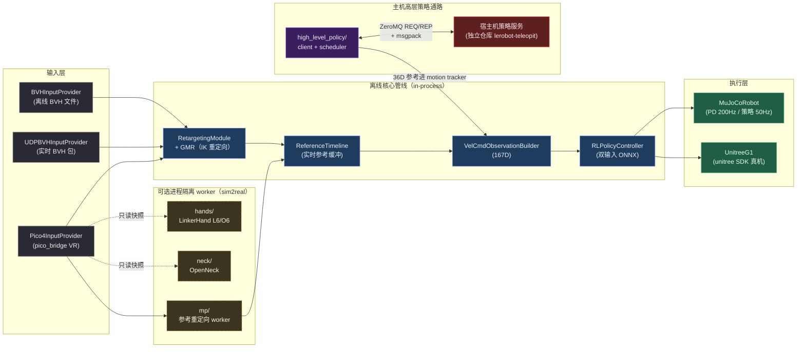
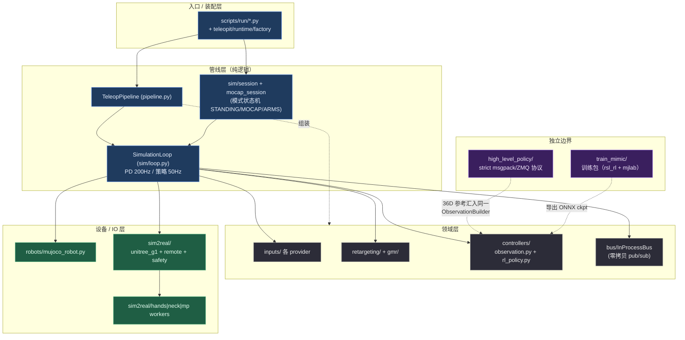
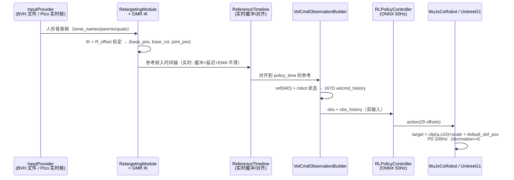
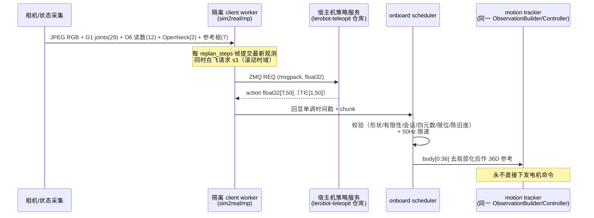
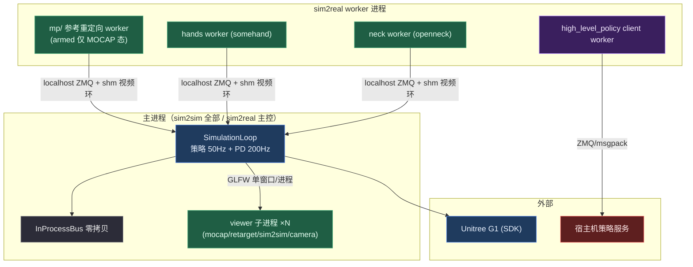

# 软件架构（architecture）

> 返回 [`knowledge/` 索引](README.md)。
> 本文是 Teleopit 的**架构地图**：用最少的篇幅让一名新工程师看懂「这个系统由什么组成、
> 数据怎么流动、在哪里扩展」。技术细节契约以根 [`AGENTS.md`](../../AGENTS.md) 为准；
> 用户视角的架构页在[用户文档站](../docs/reference/architecture.md)。

---

## 1. 系统一句话

Teleopit 是一个轻量、可扩展的人形机器人全身遥操作框架：把 **BVH 动捕文件或 Pico 4 VR
实时人体追踪**重定向为 Unitree G1 参考轨迹，由 **train_mimic 导出的 TemporalCNN ONNX
RL 策略**（167D `velcmd_history` 观测）跟踪执行——可在 **MuJoCo 仿真**跑（sim2sim），
也可上 **Unitree G1 真机**（sim2real，经 unitree SDK）；外加可选的
**LinkerHand 灵巧手**、**OpenNeck 主动视觉云台**、**主机侧高层策略**部署通路。

---

## 2. 逻辑视图（分层）

核心抽象全部定义在 [`teleopit/interfaces.py`](../../teleopit/interfaces.py) 的
`typing.Protocol` 上：`InputProvider` / `RealtimeInputProvider` / `Retargeter` /
`Controller` / `Robot` / `MessageBus`。实现可自由组合。

**分层原则**

- **接口即协议**：核心组件之间只依赖 `interfaces.py` 的 Protocol，不依赖具体实现。
- **离线核心零外部进程**：sim2sim 全链路（输入→重定向→观测→策略→MuJoCo）在单进程内
  经 `InProcessBus`（零拷贝）通信。
- **真机外设是可选 worker**：手 / 颈 / 参考重定向走进程隔离（`sim2real/mp|hands|neck`），
  localhost ZMQ + 共享内存视频环；**任何可选 worker 失败都不得中断 G1 主控**
  （AGENTS.md 反复强调的非关键性约束）。
- **主机策略边界严格**：外部主机策略边界只走 msgpack/ZeroMQ，无 pickle；
  Teleopit 不依赖 LeRobot/Transformers。

---

## 3. 关键数据流

### 3.1 主跟踪链路（BVH/Pico → G1）

观测构成（167D）与动作语义的权威定义见 `AGENTS.md`「Inference Observation」
与「Sim2Sim Pipeline」。

### 3.2 主机高层策略通路（独立部署形态）

- 模式机：`IDLE → STANDING →(Y) POLICY ↔(B) 暂停 →(X) STANDING，L1+R1 → DAMPING`。
- 超时 / 看门狗 / 主机失败 → 与远程 `B` 相同的可恢复暂停态，不自动回 `STANDING`。

### 3.3 可选外设 worker（手 / 颈）

Pico 输入只读快照（`get_controller_snapshot()` / `get_hand_snapshot()` /
`PicoFrame.head`）分发给 hands / neck worker；手失败必须张开到配置开合位，
颈 / 手 / 视频任何失败都不许停 G1 主控。细节契约见 `AGENTS.md` 相应小节。

---

## 4. 并发 / 进程模型

**关键约束**

- **一个进程一个 GLFW 窗口**：所有 viewer 各自子进程，关完全部窗口即退出。
- **进程隔离保主控**：50Hz 机器人主循环不被推理 / 外设拖死；参考 worker 只在
  `MOCAP` 态 armed（冷启动帧不会污染 GMR 暖启动）。
- **软重置语义**：暂停 / 模式切换重置策略与参考对齐（yaw/XY 重锚定），但
  **保留 GMR IK 暖启动**，不做 qpos 插值。

---

## 5. 训练 ↔ 推理边界

`train_mimic`（rsl-rl + mjlab）训练 `General-Tracking-G1` 任务，导出双输入
TemporalCNN ONNX；推理侧（`teleopit`）只消费 ONNX，不依赖训练栈。数据管线：
Pico 录制 NPZ → `build_dataset.py` 最小 HDF5 shards → `precompute_dataset.py`
预计算训练集 → 训练 → `save_onnx.py`。命令与契约见 `AGENTS.md`「Dataset
Pipeline」「Training Task」。

---

## 6. 扩展指南

| 要做的事 | 落点 | 关键约束 |
|---|---|---|
| 接新输入源（新 VR / 动捕） | 实现 `InputProvider`（实时则加 `RealtimeInputProvider`） | 纯 Protocol，不侵入管线 |
| 换机器人 | `teleopit/robots/` 新 `Robot` 实现 + `configs/robot/*.yaml` | 训练任务与 XML 关节定义须一致 |
| 换策略 | `controllers/rl_policy.py` 走双输入 ONNX | 启动即校验观测定义 vs ONNX 签名，不匹配立即报错 |
| 加外设 worker | `sim2real/<dev>/worker.py` 模式 | 非关键：失败不得停 G1 主控 |
| 改主机协议 | `high_level_policy/protocol.py` + 宿主仓库同步改 | 两仓库必须同步更新，无兼容层 |
| 加观测字段 | `controllers/observation.py` + 训练侧同步 | 167D 是当前契约，改了须重训/对齐 ONNX |

---

## 7. 进一步阅读

- 硬性规则与技术契约：根 [`AGENTS.md`](../../AGENTS.md)
- 文件级导览：[`repo-guide.md`](repo-guide.md)
- 用户文档站架构页：`docs/docs/reference/architecture.md`
- 教程（各工作流实操）：`docs/docs/tutorials/`
