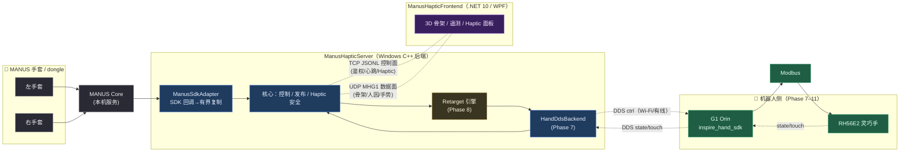
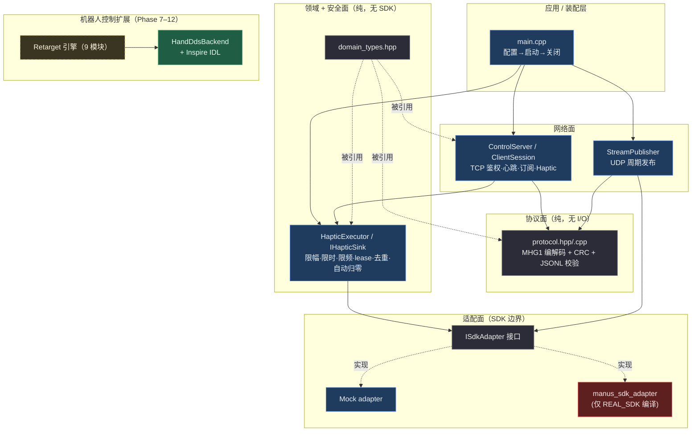
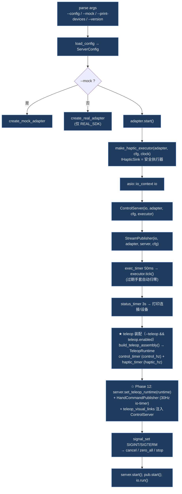
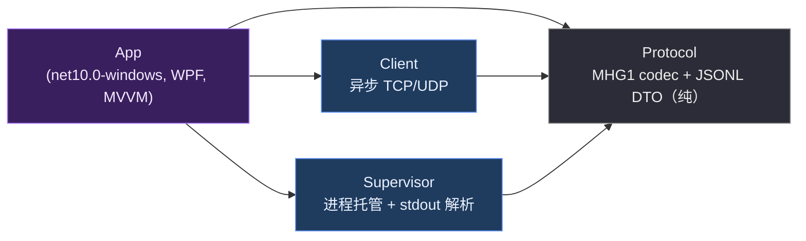
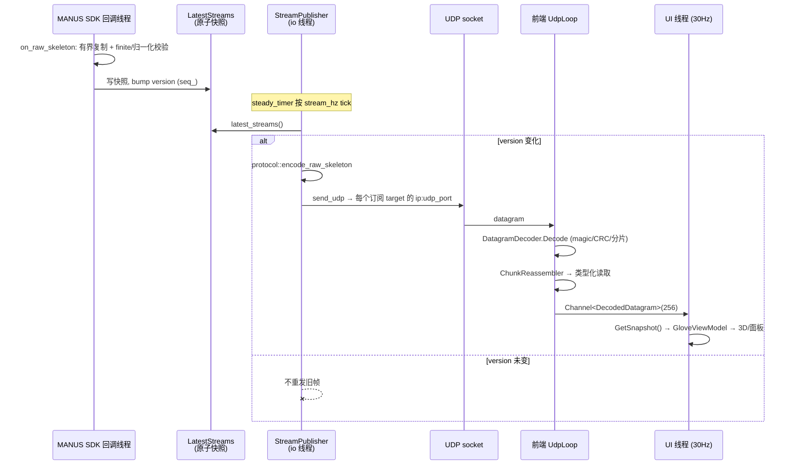
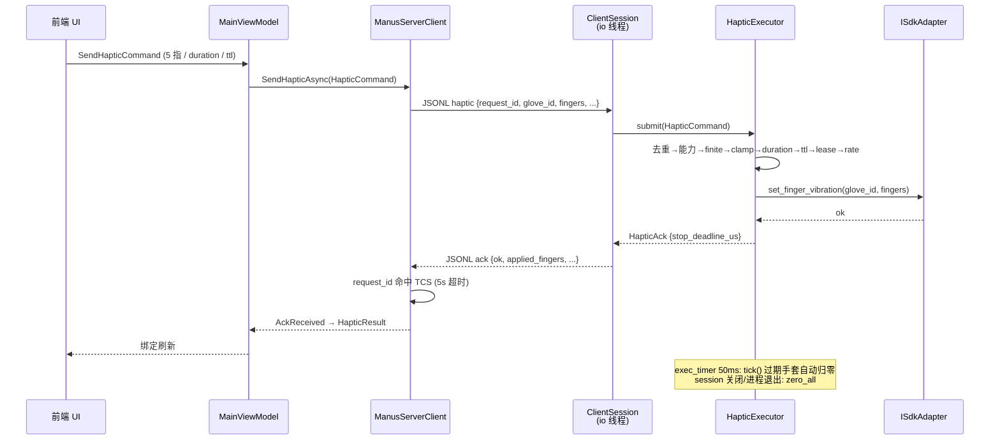
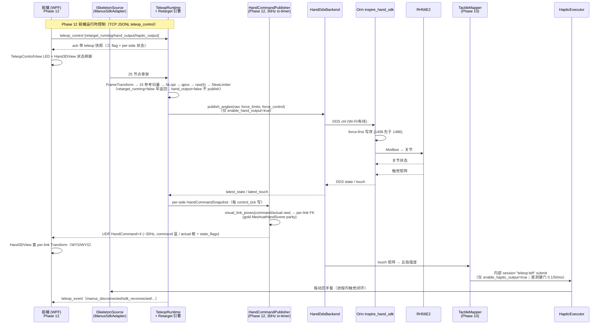
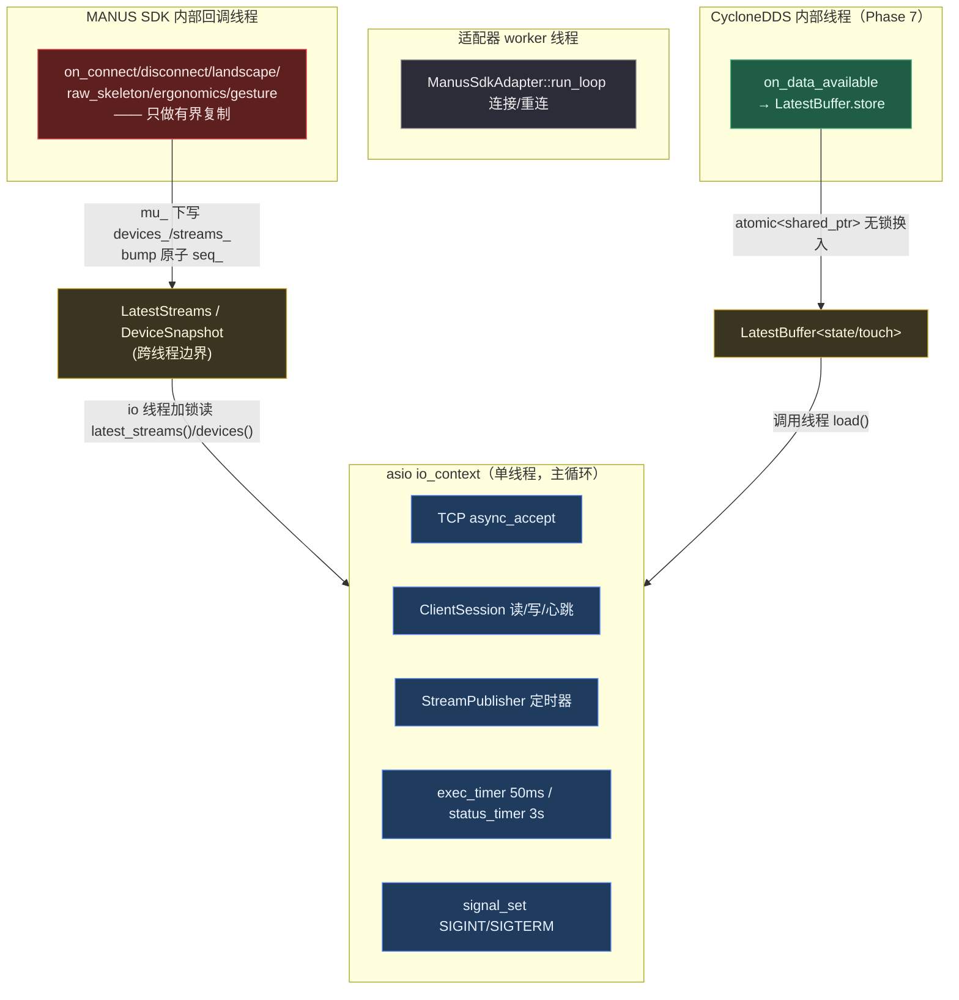
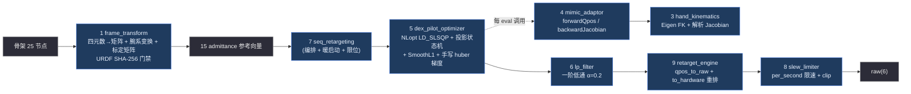

# 软件架构（architecture）

> 返回 [`knowledge/` 索引](README.md)。
> 本文是**全系统架构地图**：用最少的篇幅让一名新工程师看懂「这系统由什么组成、各部分如何协作、数据怎么流动、在哪里扩展」。
> 本文是**导览与索引**，不是单一事实源——具体数字、阶段状态、构建命令以各权威文档为准（见 [§0.2 事实源](#02-事实源一览)）。

---

## 0. 关于本文档

### 0.1 文档定位

| 读者 | 应从这里开始读 |
|---|---|
| 第一次接触本项目 | [§1 系统全景](#1-系统全景) → [§2 逻辑视图](#2-逻辑视图分层) → [§3 后端](#3-后端架构c) 或 [§4 前端](#4-前端架构net--wpf) |
| 要改协议 / 抓包 | [§5 双面协议](#5-双面协议) |
| 要追一条数据怎么走 | [§6 关键数据流](#6-关键数据流) |
| 做机器人控制（Phase 7–12） | [§8 机器人控制扩展](#8-机器人控制扩展phase-712) + [`retarget-dds-design.md`](retarget-dds-design.md) |
| 做前端运行时控制 teleop（Phase 12） | [`../plan/backend/phase-12-frontend-control.md`](../plan/backend/phase-12-frontend-control.md) + [`../superpowers/specs/2026-08-07-phase-12-frontend-teleop-control-design.md`](../superpowers/specs/2026-08-07-phase-12-frontend-teleop-control-design.md)（gitignored） |
| 要构建 / 部署 | [`build-flow.md`](build-flow.md) |
| 问「为什么这么选」 | [`decisions.md`](decisions.md)（D1–D18） |

### 0.2 事实源一览

| 事实 | 唯一归属 |
|---|---|
| 项目当前状态 / 阶段进度 | [`../STATUS.md`](../STATUS.md) |
| 关键决策 / 偏离（D1–D18） | [`decisions.md`](decisions.md) |
| 协议字段定义（控制面 §7 / 数据面 §8） | [`manus_haptic_lan_server_ai_build_guide.md`](manus_haptic_lan_server_ai_build_guide.md) |
| 构建 / 部署命令 | [`build-flow.md`](build-flow.md) |
| Phase 7–11 设计边界 | [`retarget-dds-design.md`](retarget-dds-design.md) |
| 测试结果 / 实机验收数据 | [`../../Windows/ManusHapticServer/docs/test-report.md`](../../Windows/ManusHapticServer/docs/test-report.md) |
| MANUS SDK 审计 | [`../../Windows/ManusHapticServer/sdk_audit.md`](../../Windows/ManusHapticServer/sdk_audit.md) |

> 本文出现的任何数字（端口号、字节数、限幅值、阶段状态）若与上表权威源冲突，**以上表为准**，并请回头修正本文。

---

## 1. 系统全景

**一句话**：把运行 MANUS Core 的 Windows 主机上的**手套能力**，通过**双面协议**（可靠控制面 + 高频数据面）安全串流到可信局域网客户端；并在 Phase 7–12 扩展出**重定向 + DDS + 前端运行时控制**通路，把人手姿态实时映射到 G1 Orin 上的灵巧手，再把触觉回流为手套振动，形成进程内触觉闭环；前端以 gold 法（URDF+STL FK）实时可视化重定向后的手姿态并运行时驱动三开关。



> 实线 = 已实现路径；虚线 = 经 `--teleop` 旗标 AND `teleop.enabled` 双开关条件装配（Phase 11 已接入 `main`，默认关闭），或属于规划中的 Wi-Fi 实机割接链路（L1–L4 待操作员）。

---

## 2. 逻辑视图（分层）

后端遵循一条铁律：**MANUS SDK 不得越过适配层**。领域、协议、网络、控制、发布、Haptic 各层都不 `include` 任何 MANUS 头文件；SDK 类型只活在 `manus_sdk_adapter.cpp` 一个翻译单元里（[AGENTS.md](../../AGENTS.md) 规则 2、[decisions.md](decisions.md) D2）。这条边界让整套协议、领域模型和安全逻辑可以在 **mock 模式（无 SDK / 无硬件）** 下完整构建与测试。



**分层原则**

- **领域/协议层是纯值类型与纯函数**，可独立单测，不依赖网络也不依赖 SDK。
- **SDK 回调线程只做有界复制并立即返回**（[AGENTS.md](../../AGENTS.md) 规则 6）：不做网络 I/O、阻塞日志、编码、UDP 发送，也不回调 `CoreSdk_*`/Haptic。所有重活都搬到应用自己的线程。
- **TCP handler 不直接调 Haptic SDK**：Haptic 命令经 `HapticExecutor`（串行 + 安全策略）再到适配器。
- **扩展面（DDS / Retarget）挂在既有抽象上**，不反向污染已稳定的 Phase 0–6 核心。

---

## 3. 后端架构（C++）

源码根：[`Windows/ManusHapticServer/`](../../Windows/ManusHapticServer/)。C++20，CMake + vcpkg manifest + Ninja，MSVC `/W4 /permissive- /EHsc /utf-8`。

### 3.1 模块清单（真实文件）

| 层 | 文件 | 职责 | 状态 |
|---|---|---|---|
| 领域 | `include/manus_server/domain_types.hpp` | `Side`/`ConnectionState`/`Node`(36B)/`RawSkeletonFrame`/`ErgonomicSample`/`GestureProbability`/`DeviceInfo`/`LatestStreams`/`HapticRequest`(5 指)；`static_assert(sizeof(float)==4)` | ✅ |
| 配置 | `config.hpp` / `src/config.cpp` | `ServerConfig`(Manus/Network/Security/Haptic/Gesture/**Teleop**，Phase 11) + `load_config`/`validate_config` | ✅ |
| SDK 边界 | `sdk_adapter.hpp` | 抽象接口 `ISdkAdapter`（start/stop/connection_state/devices/latest_streams/set_finger_vibration）+ 工厂 | ✅ |
| ↳ Mock | `mock_sdk_adapter.hpp` / `.cpp` | 合成两只可 haptic 手套，记录振动调用，供测试 | ✅ |
| ↳ Real | `src/manus_sdk_adapter.cpp` | 真实 MANUS Core（Phase 5）；MANUS 类型不出此文件 | ✅（REAL_SDK 编译） |
| 协议 | `protocol.hpp` / `src/protocol.cpp` | MHG1 UDP 编解码（含 Phase 12 `HandCommand=4` per-link FK）+ CRC32 + 分块重组 + JSONL 校验（含 `teleop_control` 白名单） | ✅ |
| 网络 | `net.hpp` | asio standalone 包装（MSVC 下抑制三方头告警） | ✅ |
| 控制 | `control_server.hpp` / `.cpp` | TCP acceptor + UDP 源 socket + 订阅 target 表 + 广播 | ✅ |
| ↳ Session | `src/client_session.cpp` | 会话状态机 `AwaitHello→Authenticated→Subscribed→Closing`、心跳、haptic/stop、ACK | ✅ |
| 发布 | `src/stream_publisher.cpp` | `stream_hz` 周期 tick，仅快照版本变化时编码 + UDP 单播 | ✅ |
| Haptic 安全 | `haptic_sink.hpp` / `haptic_safety.hpp` / `haptic_executor.hpp` / `.cpp` | `IHapticSink` 接口 + `HapticExecutor`（去重/能力/有限/clamp/duration/ttl/lease/rate/tick 归零） | ✅（Phase 4） |
| **DDS** | `hand_dds_backend.hpp` / `src/hand_dds_backend.cpp` | ctrl pub + state/touch sub；`LatestBuffer`（原子 shared_ptr）；`build_ctrl` 纯函数；`Config.topic_suffix`（默认 `"l"`）支持 per-side topic；QoS BestEffort+KeepLast(1) | ✅ 已接进 main（Phase 11 `--teleop` 装配，per-side 实例化） |
| ↳ IDL | `thirdparty/inspire_idl/inspire_hand_{ctrl,state,touch}.idl` | Inspire DDS 类型（1:1 移植金标准 `dds_types.py`，字段序即 XCDR 序） | ✅ |
| **Retarget** | `src/retarget/*.cpp`（8 文件） | 见 [§8.2](#82-retarget-9-模块管线) | 🟡 混合（见下） |
| **Teleop 装配** | `include/manus_server/teleop/teleop_assembly.hpp` + `src/teleop/teleop_assembly.cpp`；`real_skeleton_source.hpp` / `real_retarget_engine.hpp` | `build_teleop_assembly()` 工厂（main 与 `[teleop][system]` 测试共用同一装配路径） | ✅（Phase 11） |
| **Teleop 运行时** | `include/manus_server/teleop/teleop_runtime.hpp` + `src/teleop/teleop_runtime.cpp` | 三运行时开关（`retarget_running`/`enable_hand_output`/`enable_haptic_output`，setter/getter）+ per-side `HandCommandSnapshot`；`control_tick`/`haptic_tick` 按开关分支 | ✅（Phase 12，构造默认值零回归） |
| **HandCommandPublisher** | `include/manus_server/teleop/hand_command_publisher.hpp` + `src/teleop/hand_command_publisher.cpp` | 30Hz io-timer 读快照 → `RetargetEngine::visual_link_poses`（gold `MeshcatHandScene` parity）→ encode `HandCommand=4` UDP → 每 peer 单播 | ✅（Phase 12） |
| **协议（控制面 Phase 12）** | `src/client_session.cpp` + `include/manus_server/control_server.hpp` + `src/control_server.cpp` | `teleop_control` TCP 命令（翻三 flag）+ ack 带 `teleop` 快照 + `teleop_event` 异步推送 + `welcome` 加 `teleop_available`/`teleop_visual_links` | ✅（Phase 12） |
| 入口 | `src/main.cpp` | 装配 + 信号处理 + 统一关闭；`--teleop` 双定时器（`control_hz`/`haptic_hz`）+ `dry_run` 门禁（Phase 11）；Phase 12 装配 `HandCommandPublisher` + 注入 runtime/visual_links 给 `ControlServer` | ✅（Phase 11+12 装配形态） |
| 工具 | `tools/subscribe_dds.cpp`、`tools/loopback_dds.cpp`、`tools/test_client.py`、`tools/fk_crosscheck.py` | 真机探针 / DDS 往返自测 / Python 测试客户端 / FK 交叉校验 | ✅ |

> **Retarget 当前实现状态**（截至 2026-08-07）：Phase 8–11 已把金标准 retarget + 安全状态机 + 触觉回流 + `main.cpp` 装配完整迁入 C++（详见 [`../progress/backend/phase-8.md`](../progress/backend/phase-8.md) 至 [`phase-11.md`](../progress/backend/phase-11.md)）。上表"混合"标记针对源文件级历史状态；当前生产装配经 `RealRetargetEngine` 适配器消费 Phase 8 引擎。

### 3.2 装配（`main.cpp` 接线顺序）



> Phase 11 `--teleop` 装配（节点 J2，标 ★）：`build_teleop_assembly()` 把 `TeleopRuntime` 挂上同一 `io_context` 的双 `steady_timer`（`control_hz`/`haptic_hz`），main 与 `[teleop][system]` 测试共用此工厂。`--teleop` 旗标 AND `teleop.enabled` 双开关才进入；`dry_run=true` → `enable_hand_output=false`（L1 只读 DDS）。`HandDdsBackend` per-side 实例化（`topic_suffix` "l"/"r"）。割接铁律 + L1–L4 手册见 [`../../Windows/ManusHapticServer/docs/teleop-deploy.md`](../../Windows/ManusHapticServer/docs/teleop-deploy.md)；决策 D17 见 [`decisions.md`](decisions.md)。
>
> Phase 12 增量（节点 J3，标 ☆）：把 `teleop_asm->runtime` + `visual_links` 注入 `ControlServer`（让 `teleop_control` TCP handler 能读/写 runtime + welcome 能力位下发 link 序）；构造 `HandCommandPublisher`（30Hz io-timer，独立于 `control_hz=60`）读 per-side 快照 → `visual_link_poses` FK → `HandCommand=4` UDP 单播给每个订阅 peer；启动在 run timers 后，SIGINT 关闭在 `pub.stop()` 前。决策 D18 见 [`decisions.md`](decisions.md)。

### 3.3 源码树速览

```
Windows/ManusHapticServer/
├── CMakeLists.txt / CMakePresets.json / vcpkg.json   构建配置
├── cmake/FindManusSDK.cmake                           树内 SDK 定位（REAL_SDK 时）
├── config/                                            server.example.json / teleop.default.yaml / cyclonedds.xml / 部署脚本
├── docs/                                              deployment / teleop-deploy / protocol-examples / test-report / troubleshooting
├── include/manus_server/                              11 个公共头（+ retarget/ 子目录）
├── src/                                               10 个核心源（+ retarget/ 8 个）
├── tests/                                             Catch2（+ retarget/ 8 个 + assets/inspire_hand URDF）
├── tools/                                             subscribe_dds / loopback_dds / test_client.py / fk_crosscheck.py
└── thirdparty/inspire_idl/                            3 个 .idl（git 内）
```

---

## 4. 前端架构（.NET 10 / WPF）

源码根：[`Windows/ManusHapticFrontend/`](../../Windows/ManusHapticFrontend/)。解决方案 `ManusHapticFrontend.slnx`；`Directory.Build.props` 全局 `TreatWarningsAsErrors=true`。

### 4.1 项目依赖



依赖**单向无环**，`Protocol` 是叶子（纯 codec，无 I/O，可单测）。`Protocol` 的 codec 直接移植自后端 `tools/test_client.py`，前后端**共享同一份线规语义**。

### 4.2 各项目要点

| 项目 | 关键类型 | 职责 |
|---|---|---|
| **Protocol** | `Mhg1/DatagramDecoder`、`Crc32Ieee`、`ChunkReassembler`、`Records`；`JsonL/JsonLReader`、`ClientRequests`、`ServerMessages`、`HapticErrorCode` | UDP 二进制解码（48B 头校验/CRC/分片重组）+ TCP JSONL DTO 序列化 |
| **Client** | `IManusServerClient` / `ManusServerClient` | TCP 连接 + 本地任意 UDP 端口绑定；`ReadLoop`(JSONL) + `UdpLoop`(解码入有界 Channel) + `PingLoop`(2.5s/RTT)；`request_id` 关联 Ack（5s 超时） |
| **Supervisor** | `ServerSupervisor`、`ServerLogParser`、`LanInterfaceDetector`、`ConnectionState` | 启动后端 exe、重定向 stdout、解析 `[status]`/`[mock]`/`[sdk]` 行→`SupervisorSnapshot`；动态写临时 config（loopback/LAN）；纯 NIC 选择器 |
| **App** | `MainViewModel`、`TelemetryAggregator`、`Skeleton3DView`、`HapticControlView`、`LanSettings`、`FirewallHelper`；Phase 12 增 `Hand3DView`（HelixToolkit STL，gold 法）+ `TeleopControlView`（3 开关 + LED + 进度条 + 二次确认） | WPF/MVVM（CommunityToolkit.Mvvm + HelixToolkit.Wpf）；3D 骨架渲染、遥测面板、Haptic 控制、LAN 配置 + 防火墙；Phase 12 加 gold 法 3D 手可视化 + teleop 运行时控制面板 |

> **没有 IoC 容器**：`MainViewModel` 在构造函数 / `CreateClient` 内直接 `new` 组装依赖。**`ConnectionState` 是 stdout-only**，不在 wire 上——这是已知协议缺口，前端靠解析后端 stdout 重建状态（见 [`docs/protocol-client.md`](../../Windows/ManusHapticFrontend/docs/protocol-client.md)）。

### 4.3 前端线程模型

socket 读、UDP 接收、ping、遥测聚合全在后台 `Task`/线程池线程；所有 VM 状态写入经 `OnUi(...)`（`Dispatcher.BeginInvoke`）回到 UI 线程；UI 用 ~30Hz `DispatcherTimer` 轮询 `TelemetryAggregator.GetSnapshot()`——**UI 线程从不直接接触 90Hz 数据流**。

---

## 5. 双面协议

双端口设计避免高频姿态阻塞控制命令。控制面 = TCP JSONL（可靠、低频）；数据面 = UDP 二进制（高频、latest-wins、无重传）。**服务器把 UDP 数据单播到 TCP peer 的源 IP**，不接受客户端在 JSON 中指定任意第三方目标（防反射放大）。

### 5.1 控制面（TCP JSONL，默认 7411）

UTF-8，每条 JSON 后 `\n`，单行 ≤ 64 KiB，idle timeout 5 s，未认证连接 3 s 内须完成 `hello`。所有响应带 `protocol:1` 与 `server_time_us`。

| 消息 | 方向 | 关键字段 |
|---|---|---|
| `hello` | C→S | `protocol`/`client_id`/`token`/`udp_port`/`streams[]` |
| `welcome` | S→C | `session_id`/`udp_source_port`/`coordinate_system{handedness,up,view,unit,space}`；Phase 12 增 `teleop_available`(bool)/`teleop_visual_links`(URDF 声明序数组) |
| `device_list` | S→C | 设备表（glove_id / side / haptic 能力） |
| `gesture_schema` / `ergonomics_schema` | S→C | schema（当前线缆上恒为空数组） |
| `ping` / `pong` | 双向 | `request_id` + 时间戳；客户端 2 s ping，6 s 无消息服务端关 session |
| `haptic` | C→S | `request_id`/`glove_id`(或 `side`)/`fingers[5]`(T/I/M/R/P)/`duration_ms`/`ttl_ms` |
| `stop_haptic` | C→S | `request_id`/`glove_id` |
| `teleop_control` | C→S | `request_id`/可选 `retarget_running`/`hand_output`/`haptic_output`(三独立 bool，缺省 no-op)；翻 `TeleopRuntime` 运行时开关（Phase 12） |
| `ack` | S→C | `request_id`/`ok`/`applied_fingers[5]`/`stop_deadline_us`/`ttl_semantics`，失败带 `error{code,message}`；`teleop_control` 的 ack 额外带 `teleop{assembled,retarget_running,hand_output,haptic_output,sides[]}`（Phase 12） |
| `teleop_event` | S→C | 异步推送（无 `request_id`）：`event`(`manus_disconnected`/`sdk_reconnected`/`haptic_auto_disabled`/`sdk_error`)/`side`/`message`（Phase 12） |

错误码：`bad_request` / `unauthorized` / `unsupported_protocol` / `device_not_found` / `ambiguous_device` / `not_haptic_capable` / `lease_conflict` / `expired` / `rate_limited` / `sdk_disconnected` / `sdk_error` / `internal_error` / `teleop_not_assembled`（Phase 12：`teleop_control` 到来但后端未 `--teleop` 装配）。`request_id` 每 session 去重（≥60 s 或最近 1024 个），重复命令不二次触发。

> 字段级 schema 权威定义：工程合同 §7。

### 5.2 数据面（UDP MHG1）

每 datagram ≤ 1200 bytes（避免 IP 分片），只含一只 glove、一种 `message_type`、一个 chunk；latest-wins，无应用层重传。

**公共头 48 字节**：

| 偏移 | 类型 | 字段 | 说明 |
|---:|---|---|---|
| 0 | char[4] | `magic` | `MHG1` |
| 4 | uint8 | `version` | `1` |
| 5 | uint8 | `message_type` | 1=raw skeleton, 2=ergonomics, 3=gesture, 4=hand command（Phase 12） |
| 6 | uint8 | `side` | 0/1/2 = unknown/left/right |
| 7 | uint8 | `flags` | bit0 tracked, bit1 chunked |
| 8 | uint16 | `header_bytes` | `48` |
| 10 | uint16 | `item_bytes` | 单 record 字节 |
| 12 | uint32 | `payload_bytes` | `= item_bytes × item_count` |
| 16 | uint32 | `sequence` | 递增，回绕 |
| 20 | uint32 | `glove_id` | MANUS glove ID |
| 24 | uint64 | `sample_monotonic_us` | SDK frame 进 callback 时的**服务器单调时钟** |
| 32 | uint32 | `frame_id` | 同帧 chunks 相同 |
| 36 | uint16 | `item_count` | 本 chunk record 数 |
| 38 | uint16 | `chunk_index` | 从 0 |
| 40 | uint16 | `chunk_count` | ≥1 |
| 42 | uint16 | `reserved` | 0 |
| 44 | uint32 | `crc32` | 此字段置 0 后与 payload 一起算 IEEE CRC-32 |

**Record**：Raw Skeleton 36 B（`node_id`/`parent_node_id`(根=-1)/`position[3]`/`quaternion[4]` xyzw，一包最多 32 节点恰 1200 B）；Ergonomics 8 B（`data_type`/`value`）；Gesture 8 B（`gesture_id`/`probability`∈[0,1]）；**HandCommand**（Phase 12，单 item/datagram）：prefix 79 B（`command_raw[6]`/`target_raw[6]`/`actual_raw[6]`/`blend`/`state_flags`(b0 retarget_running, b1 hand_output, b2 haptic_output, b3 armed, b4 haptic_disabled, b5 connected, b6 device_ready, b7 actual_valid)/`valid_frames`）+ 2×N_link×28 B（command pose / actual pose，每 link = `quat[4]` xyzw + `pos[3]`，N_link 由 URDF 可视 link 数定，左手 = 13 → 807 B + 头 48 = 855 B 单 chunk）。per-link FK 由后端 `RetargetEngine::visual_link_poses`（gold `MeshcatHandScene` parity）算，~30Hz 单播给前端。

**编码铁律**：逐字段写入 byte buffer，**禁止 `reinterpret_cast`/`memcpy` 整个 struct**；多字节字段固定 little-endian；浮点固定 IEEE-754 binary32。

> 字段级权威定义：工程合同 §8；CRC32 check value `0xCBF43926`（前后端各有一份独立实现互校）。

---

## 6. 关键数据流

### 6.1 姿态串流（后端 → 前端，UDP）



### 6.2 Haptic 命令闭环（前端 → 后端，TCP）



### 6.3 重定向 → DDS → 灵巧手（Phase 7–12，`--teleop` 装配链路 + Phase 12 前端控制 / 3D 手 viz）



> 此链路 Phase 11 已装配到 `main`（`--teleop` 旗标 AND `teleop.enabled` 双开关启用，经 `build_teleop_assembly()` 工厂）；Phase 12 在其上加前端运行时三开关（`teleop_control` TCP）+ `HandCommandPublisher`（30Hz UDP `HandCommand=4`，per-link FK）+ 前端 `Hand3DView`（gold 法 STL）+ `TeleopControlView`。`[teleop][system]`/`[control][teleop]` 注入式系统测试绿；仿真闭环目视已过 + Wi-Fi 实机割接 L1/L2/L3 + 手动触觉已通过（2026-08-08 凌晨，11/12 DOF）；自动触觉 pipeline + 左 motor 1 收尾。割接铁律：**绝不能与 Python `manus-haptic-rt.service` 同时发布 ctrl**——Python 进程必须先停（详见 [`../../Windows/ManusHapticServer/docs/teleop-deploy.md`](../../Windows/ManusHapticServer/docs/teleop-deploy.md) §3）。

---

## 7. 并发与线程模型

整套系统的并发设计围绕「**单 asio io_context 串行核 + SDK 回调有界复制 + 原子快照跨线程**」展开。



**关键约束**

- 第一版 `io_context` **单线程**运行，控制面与数据面共用同一串行驱动核，减少锁复杂度。
- **跨线程边界 = 有界最新值存储**：SDK 回调线程 / DDS 线程只写快照并 bump 版本号；io 线程读快照。姿态只保留最新值；手势事件队列满时丢最旧并计数。
- `HapticExecutor` 内部 `mu_` 保护状态，使其对 SDK 回调线程安全；`submit`/`tick`/`release_session` 实质串行于 io 线程。
- DDS 订阅侧经 `std::atomic<std::shared_ptr<const T>>` 原子换入（无锁发布）；发布侧 `publish_angles` 在调用线程同步写。

---

## 8. 机器人控制扩展（Phase 7–12）

工程合同首版明确**不含机器人控制**；Phase 7–12 是其后的扩展，把金标准 Python 仓库 `manus_haptic_rt` 的实时控制能力（DexPilot 重定向 + 安全状态机 + 触觉→振动 + 前端运行时控制）迁入 C++ 后端 + WPF 前端。设计边界见 [`retarget-dds-design.md`](retarget-dds-design.md)；Phase 12 前端控制设计见 [`../superpowers/specs/2026-08-07-phase-12-frontend-teleop-control-design.md`](../superpowers/specs/2026-08-07-phase-12-frontend-teleop-control-design.md)（gitignored）。

### 8.1 目标拓扑

```
手套 → Core → ManusHapticServer(Windows C++)
                │ 重定向 + 安全 + 触觉（in-process，消 LatestStreams，省掉 UDP 一跳）
                ├─DDS ctrl ─[Wi-Fi/有线]→ Orain inspire_hand_sdk → Modbus → RH56E2
                ◀─DDS state/touch ─[Wi-Fi]─┘
                └─触觉 → TactileMapper → HapticExecutor(已有) → SDK → 手套振动（进程内闭环）
```

### 8.2 Retarget 9 模块管线

每新帧的离线/在线同链数据流（[Phase 8 spec](../superpowers/specs/2026-08-04-phase-8-retarget-design.md)）：



| # | 模块 | 职责（Python 金标准对应） | 当前状态 |
|---:|---|---|---|
| 1 | `frame_transform` | `transforms.py`：腕系变换 + 标定 + URDF hash 门禁 | 🟡 占位 |
| 2 | `urdf_loader` | runtime 解析 URDF（urdfdom）→ `HandModelConfig` | ✅ 已实现 |
| 3 | `hand_kinematics` | `robot_wrapper.py`：Eigen 6-DOF 串链 FK + 解析 Jacobian | ✅ 已实现 |
| 4 | `mimic_adaptor` | `kinematics_adaptor.py`：mimic 展开 + 链式反传 | 🟡 占位 |
| 5 | `dex_pilot_optimizer` | `optimizer.py:DexPilot`：NLopt + 投影 + loss + 手写梯度 | 🟡 占位 |
| 6 | `lp_filter`（`time_filters.cpp`） | `optimizer_utils.py`：一阶低通 | 🟡 占位 |
| 7 | `seq_retargeting` | `seq_retarget.py`：编排 + LP + 暖启动 + 限位 | 🟡 占位 |
| 8 | `slew_limiter` | `engine.py`：raw 域 per_second 限速 | 🔴 未建文件 |
| 9 | `retarget_engine` | `engine.py`：YAML 载入 + 构建 + `qpos_to_raw` + 硬件重排 | 🟡 占位 |

> 隔离约束：所有 retarget 模块**不得 include `ManusSDK.h`**（保持 SDK 隔离）。Pinocchio **仅作离线交叉校验 oracle**（`tools/fk_crosscheck.py`），非 C++ runtime 依赖（[decisions.md](decisions.md) D14）。

### 8.3 安全关键要点

- **stale-ctrl**：Orin `ModbusDataHandler` 无看门狗，不发 ctrl → 手保持最后位姿。**ctrl 发布权 = 安全权**；发布侧超时状态机（Phase 9 照搬 `runtime.py`）是唯一安全兜底。
- **force-first 写序**：Orin driver 必须 `1498 FORCE_SET` 先于 `1486 ANGLE_SET`，否则首帧过握。C++ 侧保：真实控制永远 `mode=0b0101`，发布侧校验 `force_set ∈ (0, 3000]`。
- **IDL 字段序即 wire 序**：逐字段与金标准 `dds_types.py` 一致；指序 one=小拇指…five=大拇指。cross-DDS 互通由 Phase 7 loopback + Orin 实机门禁验证，**不以「同栈」推定兼容**。

### 8.4 路线图

| Phase | 主题 | 状态 |
|---|---|---|
| 7 | cyclonedds-cxx DDS 层（ctrl / state·touch / Inspire IDL / 网卡绑定） | ✅ 实机门禁通过 |
| 8 | DexPilot 重定向（Eigen + NLopt / 离线对齐 oracle） | ✅ |
| 9 | 安全状态机（`runtime.py` 1:1 迁移 + 标定载入 + URDF hash 门禁） | ✅ |
| 10 | 触觉→振动（TactileMapper + 接 `HapticExecutor` 内部 session） | ✅ |
| 11 | 集成与实机验收（`teleop_runtime` 装配 + Wi-Fi DDS 割接 + 分阶段门禁） | 🟧 代码完成（装配 + loopback 测试 + 文档；实机 L1–L4 待验收） |
| 12 | 前端运行时控制 teleop（三运行时开关 + `HandCommand=4` UDP + gold 法 3D 手 + 仿真闭环 + 真机 L1–L4） | 🟧 代码完成（T1–T6 全绿：后端 1215/128 + 前端 70/70；仿真闭环目视 + 真机 L1–L4 待操作员） |
| 13 | 后端双手扩展（原 `2026-08-07-phase-12-dual-hand-design.md`，D18 改编号） | 🔴 待做 |

> 阶段状态以 [`../STATUS.md`](../STATUS.md) 为准；未过上一级不进下一级。Phase 11：`TeleopRuntime` 已挂 `io_context` 双定时器（`control_hz`/`haptic_hz`）；`--mock --teleop --dry-run` 启动 + `[teleop][system]` 注入式全链路系统测试绿；割接铁律 + L1–L4 操作手册见 [`../../Windows/ManusHapticServer/docs/teleop-deploy.md`](../../Windows/ManusHapticServer/docs/teleop-deploy.md)。Phase 12：前端 `teleop_control` TCP 翻三运行时开关 + `HandCommandPublisher` 30Hz 把 per-link FK 经 `HandCommand=4` UDP 单播 + 前端 `Hand3DView`（gold 法 STL，command 蓝 / actual 橙）；L1–L4 改前端驱动版（前端关控制输出即时停发，比改 config+重启快）；决策 D18 见 [`decisions.md`](decisions.md)；spec 见 [`../superpowers/specs/2026-08-07-phase-12-frontend-teleop-control-design.md`](../superpowers/specs/2026-08-07-phase-12-frontend-teleop-control-design.md)（gitignored）。

---

## 9. 关键技术决策速查

完整理由与出处见 [`decisions.md`](decisions.md)。摘要：

| # | 决策 | 一句话理由 |
|---|---|---|
| D1 | VS 2026 / MSVC 14.51 | 本机实际版本（合同写 2022） |
| D2 | MANUS SDK 在树内 `thirdparty/ManusSDK/` | git-ignored、受许可不分发 |
| D3 | `cl/cmake/ninja` 仅在 Developer PowerShell for VS 2026 | 随 VS 打包，不在系统 PATH |
| D4 | vcpkg 在 `F:/teleop/vcpkg` | 本机实际位置 |
| D5 | github 需代理 | 本机网络环境 |
| D7 | `coordinate_space` 默认 `world` | 与 SDK MinimalClient 一致 |
| D11/D12 | LAN 配置由前端 supervisor 动态生成；防火墙统一 `LocalSubnet`；NIC 退化 tie-break | 自动满足后端 token+CIDR 强制；真 metric 成本不值 |
| D13 | DDS 用 `cyclonedds-cxx` 0.10.5（非 unitree 预编译包） | 服务端须 Windows/MSVC 构建，备选仅 Linux 二进制 |
| D14 | Retarget 用 Eigen + NLopt（不引 Pinocchio runtime） | 降低 Windows/MSVC 构建复杂度，Pinocchio 仅离线 oracle |
| D15 | Phase 7–11 是工程合同后的机器人控制扩展；割接只退役 Python ctrl 发布进程 | 保留原有 SDK 隔离 / 安全 Haptic / 阶段门禁约束 |
| D16 | Phase 10 触觉标定 C++ 侧读 gold `save()` 产出的 JSON sidecar | 复用 nlohmann-json、零新依赖；gold `load()` 不变 |
| D17 | Phase 11 teleop 装配：`build_teleop_assembly` 工厂 + `--teleop` AND `teleop.enabled` 双开关 + `dry_run` 门禁 + per-side `HandDdsBackend::Config.topic_suffix`；DDS 网卡绑定经 `CYCLONEDDS_URI`（Config 字段不 wired） | 复用 Phase 9/10 串行 io 模型零新线程；dry_run 给割接安全起点；per-side topic 是双侧前提 |
| D18 | Phase 12 前端运行时控制 teleop：`TeleopRuntime` 三运行时开关（`retarget_running`/`hand_output`/`haptic_output`）替代 config+重启；gold 法 3D 手（URDF+STL FK，WYSIWYG）；`HandCommand=4` UDP + `teleop_control`/`teleop_event` TCP + `welcome` 能力位；旧 dual-hand spec 改编号 Phase 13 | 让前端成为 teleop 驾驶舱（启停 / mute / 触觉 + 可视化），回退从「改 config+重启」提速到「即时停发」；构造默认值零回归；L4 首测硬门不降级 |

---

## 10. 构建与部署速查

完整流程见 [`build-flow.md`](build-flow.md)。要点：

- **后端**（Developer PowerShell for VS 2026）：`cmake --preset windows-msvc-debug` → `cmake --build --preset windows-msvc-debug` → `ctest --preset windows-msvc-debug`。三个 preset：`debug`/`release`（mock）、`debug-real`（REAL_SDK=ON，关测试，需 `thirdparty/ManusSDK`）。
- **前端**（任意 shell）：`dotnet build/test ManusHapticFrontend.slnx`；`dotnet run --project src/ManusHapticFrontend.App`（GUI）或 `-- --selftest`（无头自检）。
- **运行耦合**：前端自动探测 `Windows/ManusHapticServer/out/build/**/manus_haptic_server.exe`；Mock 模式偏好非 real 构建，Real 模式偏好 `windows-msvc-debug-real`。
- **安全规则**：真实 Haptic 每次需人批准且人在场，首测 ≤0.1 强度 / ≤50ms；真实 LAN 监听必须同时配置非空 token + allowlist，否则启动失败。

---

## 11. 扩展指南

| 要做的事 | 落点 | 关键约束 |
|---|---|---|
| 接入第二输入源（如 PICO） | 新增一个 `ISkeletonSource` 实现 | domain 层纯虚接口，不加 MANUS 依赖 |
| 加新 DDS topic | `thirdparty/inspire_idl/*.idl` + `HandDdsBackend` 增 reader/writer | 字段序即 XCDR wire 序；QoS BestEffort+KeepLast(1) |
| 加新 retarget 模块 | `src/retarget/<name>.cpp` + `include/manus_server/retarget/<name>.hpp` + Catch2 单测 | 不得 `include ManusSDK.h`；数值对齐金标准 |
| 改协议（新消息/字段） | 同步改后端 `protocol.*` / `client_session.cpp` 与前端 `Protocol/JsonL/*` | 未知字段向前兼容；新 `type` 必须返回结构化 error |
| 改 UI 视觉 | [`frontend-ui-style.md`](frontend-ui-style.md) + [`ui/ui-ref-modern-dark.md`](ui/ui-ref-modern-dark.md) | 暗色 design token 系统 |
| 新增/移动文档 | [`doc-conventions.md`](doc-conventions.md) | plan↔progress 配对、单一事实源 |

---

## 12. 进一步阅读

- **深度协议**：[`manus_haptic_lan_server_ai_build_guide.md`](manus_haptic_lan_server_ai_build_guide.md) §7/§8
- **构建细节**：[`build-flow.md`](build-flow.md)
- **机器人扩展**：[`retarget-dds-design.md`](retarget-dds-design.md) + Phase 8 spec
- **决策缘由**：[`decisions.md`](decisions.md)
- **文档约定**：[`doc-conventions.md`](doc-conventions.md)
- **当前状态**：[`../STATUS.md`](../STATUS.md)
